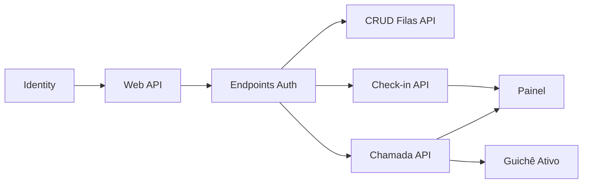

# BACKLOG - Sistema de Gerenciamento de Filas (SmartKiwi)

---

## [CONCLUÍDO]

### Estrutura e Arquitetura
- Solução dividida em `SmartKiwiApp` (aplicação) e `SmartKiwiTest` (testes)
- Projeto .NET 9 com Entity Framework Core InMemory
- Camadas separadas: Models, Data, Repository, Services

### Modelos de Domínio
- `Client` — Representa um cliente na fila, com ticket e nome opcional
- `ClientQueue` — Fila com nome, prefixo, prioridade, controle de chamada e timeout
- `Call` — Registro de chamada de atendimento (cliente, atendente, guichê, data/hora)
- `Atendante` — Atendente com nome e número de guichê
- `Workstation` — Guichê com nome e número (estrutura inicial)
- `User` — Estrutura inicial removida de validações, aguardando integração com Identity

### Camada de Repositórios
- `IClientQueueRepository` / `ClientQueueRepository` — CRUD de filas com persistência
- `IUserRepository` / `UserRepository` — substituído por Identity (removido)
- `IClientRepository` / `ClientRepository` — CRUD de clientes implementado

### Camada de Serviços
- `ClientQueueService` — CRUD de filas com validações básicas
- `CheckinService` — Geração de ticket e enfileiramento de clientes
- `AtendanteService` — Processamento da próxima chamada via QueueEngine
- `UserService` — Cadastro, autenticação e gerenciamento de usuários (migrado para Identity)
- `PasswordService` — removido (substituído por Identity)
- `HashService` — removido (substituído por Identity)
- `TokenService` (legado) — removido; novo `TokenService` a ser criado para emissão de JWT via Identity

### Motor de Filas
- `QueueEngine` — Engine de seleção de filas com algoritmo round-robin ponderado por prioridade
- Suporte a timeout (máximo de espera por fila)
- Reset de prioridades após ciclo completo
- Tratamento de filas vazias

### Testes Unitários (xUnit + Moq)
- Testes para `UserService` (criação, autenticação, atualização, exclusão)
- Testes para `ClientQueueService` (criação, busca, atualização)
- Testes para `QueueEngine` (sequência, timeout, fila vazia)
- Testes para `CheckinService`
- Testes para `AtendanteService`
- Testes para `TokenService`
- Testes para `PasswordService` e `HashService`
- Testes para `UserRepository`

---

## [A FAZER]

### PRIORIDADE 🔴 — MVP (Sprint 1)

---

#### 1. Integração com ASP.NET Core Identity

**User Story:** Como administrador do sistema, quero que a autenticação seja gerenciada pelo ASP.NET Core Identity com JWT, para que o login seja seguro e padronizado sem código customizado.

**Critérios de Aceite:**
- [x] `User.cs` estende `IdentityUser<Guid>` com propriedades extras `Name` (string) e `UserRole` (enum Role)
- [x] Campo `Email` herdado do Identity, não declarado manualmente
- [x] Campo `PasswordHash` herdado do Identity
- [x] `SmartKiwiContext` estende `IdentityDbContext<User, IdentityRole<Guid>, Guid>`
- [x] Adicionar pacote `Microsoft.AspNetCore.Identity.EntityFrameworkCore`
- [ ] Manter pacote `Microsoft.AspNetCore.Authentication.JwtBearer` (configurar para emitir/validar JWT via Identity)
- [x] Remover arquivos legados: `JwtConfig.cs`, `TokenService.cs` (antigo), `PasswordService.cs`, `HashService.cs`
- [x] Remover interfaces legadas: `ITokenService`, `IPasswordService`, `IHashService`
- [ ] Configurar Identity no pipeline com regras de senha:
  - Mínimo 8 caracteres
  - Exigir maiúscula, minúscula, dígito e caractere especial
  - Exigir email único
- [ ] Configurar autenticação via JWT (`AddJwtBearer`)
- [ ] Configurar autorização com as roles `Admin` e `Employee`
- [ ] Criar roles `Admin` e `Employee` no startup via `RoleManager`

**Regras de Negócio:**
- RN01: Todo usuário deve ter um email único no sistema
- RN02: Apenas usuários com role `Admin` podem criar novos operadores
- RN03: A senha deve seguir as regras de complexidade do Identity configuradas

**Prioridade:** 🔴 Alta

---

#### 2. Migrar UserService para UserManager do Identity

**User Story:** Como desenvolvedor, quero que o serviço de usuários utilize `UserManager` e `SignInManager` do Identity, eliminando a camada manual de hash e token.

**Critérios de Aceite:**
- [ ] `UserService.CreateNewUser()` usa `UserManager.CreateAsync()` em vez de `_userRepository.Add()`
- [ ] `UserService.AuthenticateUser()` usa `SignInManager.PasswordSignInAsync()` em vez de validação manual de hash
- [ ] Métodos `UpdateUserName()`, `UpdateUserEmail()`, `UpdateUserPassword()`, `DeleteCurrentUser()` usam `UserManager`
- [ ] `UserRepository` removido ou adaptado (Identity provê persistência via UserManager)
- [ ] `IUserRepository` removido
- [ ] Testes de `UserServiceTests/` e `UserRepositoryTests/` atualizados ou removidos
- [ ] Testes de `PasswordServiceTests`, `HashServiceTests`, `TokenServiceTests` removidos
- [ ] Projeto compila sem erros

**Prioridade:** 🔴 Alta

---

#### 3. Migrar de Console Application para Web API

**User Story:** Como desenvolvedor, quero que o projeto seja uma Web API para expor endpoints RESTful, substituindo a interface de console.

**Critérios de Aceite:**
- [ ] SDK do `.csproj` alterado para `Microsoft.NET.Sdk.Web`
- [ ] `Program.cs` configurado com `WebApplication.CreateBuilder(args)`
- [ ] Serviços registrados no DI: DbContext, Repositories, Services, Identity
- [ ] Controllers configurados (`AddControllers()`)
- [ ] Swagger/OpenAPI configurado (opcional para desenvolvimento)
- [ ] EF Core InMemory mantido para desenvolvimento

**Prioridade:** 🔴 Alta

---

### PRIORIDADE 🟡 — MVP (Sprint 2)

---

#### 4. Endpoints de Autenticação

**User Story:** Como operador, quero fazer login no sistema e acessar meus dados para utilizar as funcionalidades protegidas.

**Critérios de Aceite:**
- [ ] `POST /api/auth/login` — Recebe `{ email, password }`, retorna `{ token, expiresAt }`
- [ ] `POST /api/auth/register` — Apenas Admin, cria novo operador via `UserManager`
- [ ] `GET /api/auth/me` — Retorna dados do usuário autenticado via JWT
- [ ] Rotas protegidas com `[Authorize]` e `[Authorize(Roles = "Admin")]`
- [ ] Testes: senha inválida → 401, email não cadastrado → 401, acesso não autenticado → 401, register sem role Admin → 403

**Regras de Negócio:**
- RN04: Apenas usuários com role `Admin` podem acessar `POST /api/auth/register`

**Prioridade:** 🟡 Média

---

#### 5. Tratamento Global de Erros

**User Story:** Como desenvolvedor, quero um middleware global que padronize as respostas de erro da API.

**Critérios de Aceite:**
- [ ] Middleware captura exceções e retorna JSON padronizado:
  - `ArgumentException` → 400 Bad Request
  - `InvalidOperationException` → 409 Conflict
  - `UnauthorizedAccessException` → 401 Unauthorized
  - `NotFoundException` → 404 Not Found
  - Erros não mapeados → 500 Internal Server Error

**Prioridade:** 🟡 Média

---

#### 6. Implementar ClientRepository

**User Story:** Como desenvolvedor, quero uma implementação concreta de `IClientRepository` para persistir clientes.

**Critérios de Aceite:**
- [ ] `ClientRepository : IClientRepository` com `Add`, `GetRemainClients`, `RemoveClient`
- [ ] Injeção de `SmartKiwiContext` via construtor
- [ ] Registrado no DI

**Prioridade:** 🟡 Média

---

#### 7. Centralizar Validações Duplicadas em ClientQueueService

**User Story:** Como desenvolvedor, quero que as validações de nome e prioridade não estejam duplicadas no `ClientQueueService`.

**Critérios de Aceite:**
- [ ] Validação de nome extraída para método privado reutilizável (`ValidateQueueName()`)
- [ ] Validação de prioridade extraída para método privado reutilizável (`ValidateQueuePriority()`)
- [ ] Ambos os métodos usados tanto no Create quanto no Update
- [ ] Todos os testes de `ClientQueueTests/` passam

**Prioridade:** 🟡 Média

---

### PRIORIDADE 🟢 — MVP (Sprint 3)

---

#### 8. CRUD de Filas (API)

**User Story:** Como operador, quero gerenciar filas via API para criar, listar, atualizar e remover filas do sistema.

**Critérios de Aceite:**
- [ ] `GET    /api/queues` — Lista filas do usuário autenticado
- [ ] `GET    /api/queues/{id}` — Obtém fila por ID
- [ ] `POST   /api/queues` — Cria fila (body: `{ name, prefix, priority }`)
- [ ] `PUT    /api/queues/{id}/name` — Atualiza nome
- [ ] `PUT    /api/queues/{id}/priority` — Atualiza prioridade
- [ ] `PUT    /api/queues/{id}/prefix` — Atualiza prefixo
- [ ] `DELETE /api/queues/{id}` — Remove fila
- [ ] Todos os endpoints exigem autenticação via JWT
- [ ] Respostas REST: 201 (criação), 204 (sucesso sem corpo), 400 (validação), 401 (não autenticado), 404 (não encontrado)

**Prioridade:** 🟢 Média-Baixa

---

#### 9. Check-in (API)

**User Story:** Como operador, quero realizar check-in de clientes em uma fila via API para gerar tickets de atendimento.

**Critérios de Aceite:**
- [ ] `POST /api/queues/{queueId}/checkin` — Check-in com nome opcional (`{ clientName }`)
- [ ] Retorna o ticket gerado (`{ ticket: "P004", clientId, queueName }`)
- [ ] Valida que a fila existe
- [ ] Incrementa `LastTicktNumber` corretamente
- [ ] Prefixo da fila + número formatado (ex: `P004`)

**Regras de Negócio:**
- RN05: O ticket é composto pelo prefixo da fila + número sequencial formatado com 3 dígitos

**Prioridade:** 🟢 Média-Baixa

---

#### 10. Chamada de Atendimento (API)

**User Story:** Como atendente, quero chamar o próximo cliente da fila via API para iniciar o atendimento.

**Critérios de Aceite:**
- [ ] `POST /api/attendance/call` — Chama próximo cliente (body: `{ atendanteName, ticketWindow }`)
- [ ] Retorna `{ clientName, ticket, ticketWindow }` do cliente chamado
- [ ] Cria registro de `Call` no banco
- [ ] Remove o cliente da fila
- [ ] Retorna 204 se não houver clientes na fila
- [ ] Usa `QueueEngine` para selecionar a próxima fila (prioridade + timeout)

**Prioridade:** 🟢 Média-Baixa

---

### PRIORIDADE 🔵 — Pós-MVP (Sprint 4)

---

#### 11. Guichê (Workstation) com Ativação/Desativação

**User Story:** Como administrador, quero gerenciar guichês de atendimento, ativando e desativando conforme a necessidade.

**Critérios de Aceite:**
- [ ] `Workstation` estendida com `IsActive` (bool)
- [ ] `IWorkstationRepository` e `WorkstationRepository` criados
- [ ] `WorkstationService` com `Activate()`, `Deactivate()`, `ListActive()`, `ListAll()`
- [ ] `GET    /api/workstations` — Lista todos
- [ ] `GET    /api/workstations/active` — Lista apenas ativos
- [ ] `POST   /api/workstations` — Cria guichê
- [ ] `PUT    /api/workstations/{id}/activate` — Ativa
- [ ] `PUT    /api/workstations/{id}/deactivate` — Desativa
- [ ] `DELETE /api/workstations/{id}` — Remove apenas se sem histórico de uso

**Prioridade:** 🔵 Baixa

---

#### 12. Vincular Chamada com Guichê Ativo

**User Story:** Como atendente, quero que a chamada de atendimento valide se o guichê informado está ativo.

**Critérios de Aceite:**
- [ ] `POST /api/attendance/call` valida que `ticketWindow` corresponde a um guichê ativo
- [ ] Retorna 400 se o guichê estiver inativo ou não existir

**Prioridade:** 🔵 Baixa

---

#### 13. Painel de Exibição

**User Story:** Como operador, quero um painel que exiba o estado atual das filas, guichês ativos e últimas chamadas.

**Critérios de Aceite:**
- [ ] `GET /api/panel` — Retorna:
  - Guichês ativos
  - Últimas N chamadas (ex: 10)
  - Status das filas (nome, quantidade aguardando, último ticket)
- [ ] `PanelService` criado para agregar dados
- [ ] Guichês inativos não aparecem no painel

**Prioridade:** 🔵 Baixa

---

## 📊 Resumo de Prioridades

| Prioridade | Sprint | Itens |
|---|:---:|---|
| 🔴 Alta | Sprint 1 | Identity, UserService migração, Web API, AuthController (login, me, register) |
| 🟡 Média | Sprint 2 | Error handling, register protegido, ClientRepository (DI), validações |
| 🟢 Média-Baixa | Sprint 3 | CRUD filas API, Check-in API, Chamada API |
| 🔵 Baixa | Sprint 4 | Guichê, Painel |

## 🧱 Dependências do MVP

